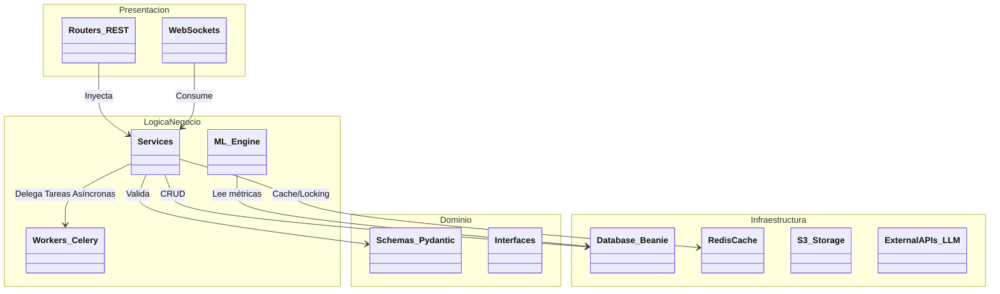
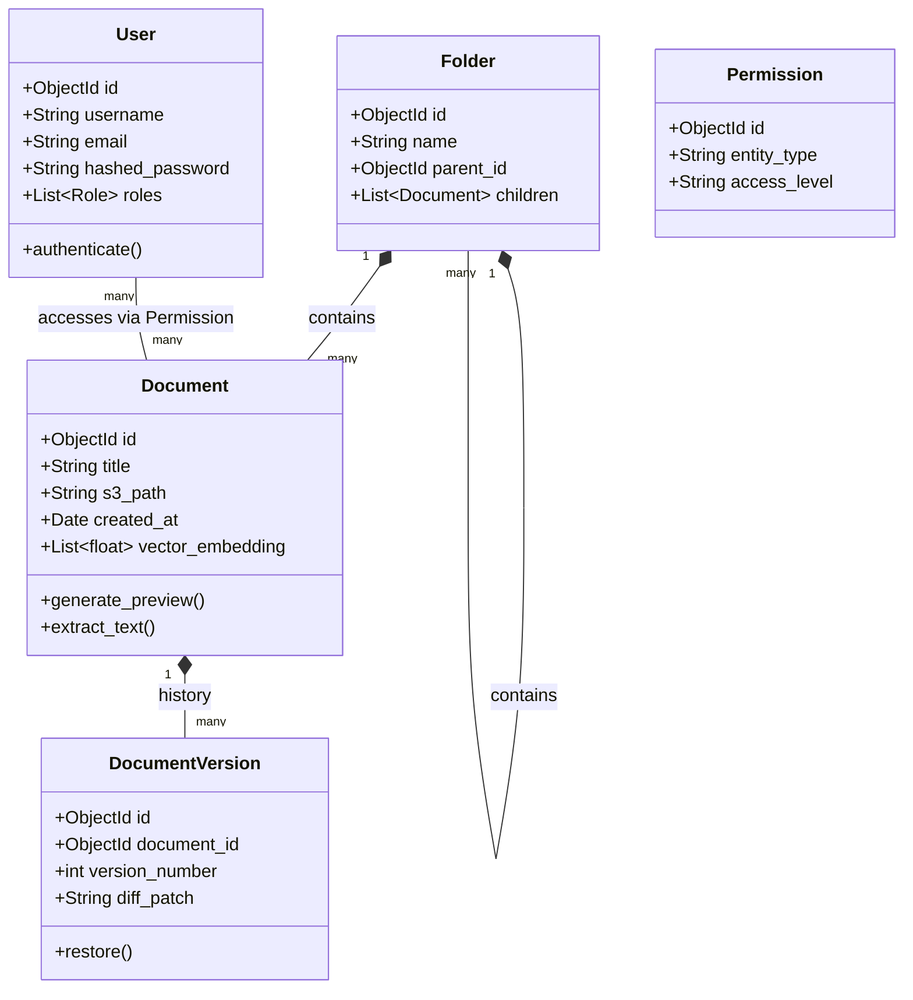
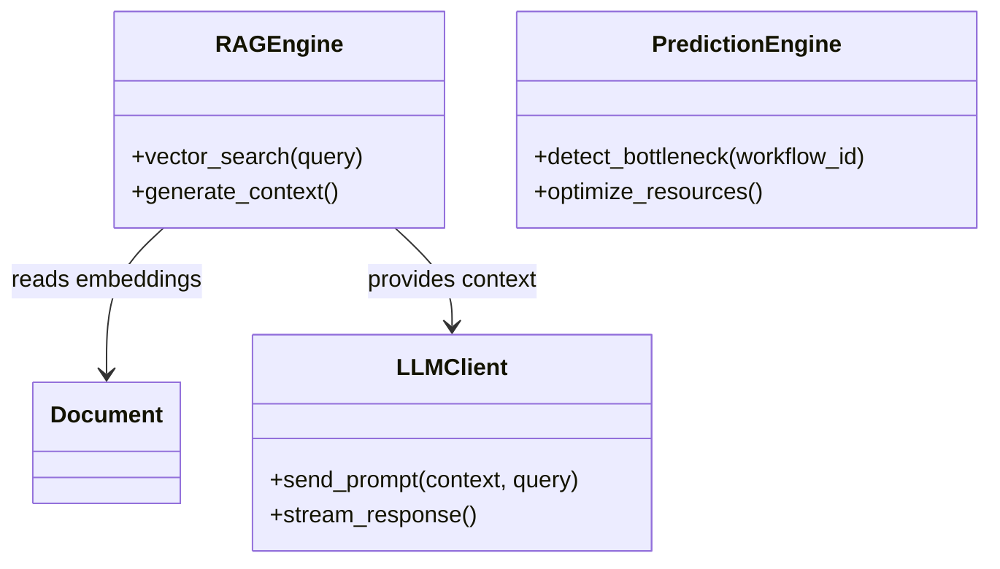

# Vista Lógica (Modelo Estático PUDS)

La Vista Lógica describe el modelo de objetos y la organización estructurada en paquetes del sistema SGDIA, apoyando la funcionalidad descrita en los Casos de Uso.

## 1. Diagrama de Paquetes (Arquitectura Capas N)

El backend de FastAPI sigue los principios de Clean Architecture y DDD (Domain-Driven Design).

## 2. Diagrama de Clases Central (Dominio Documental)

## 3. Diagrama de Clases (Machine Learning & IA)

