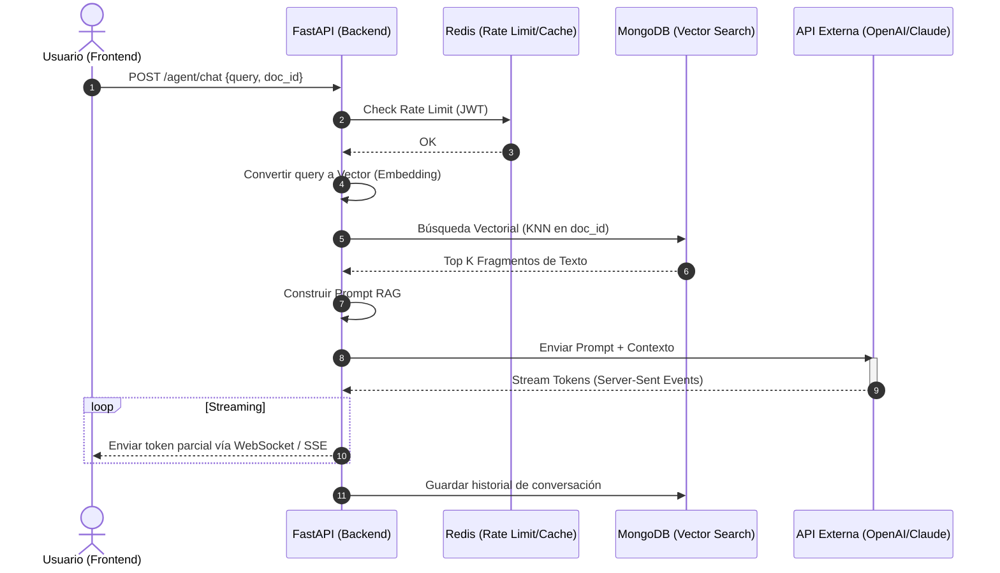
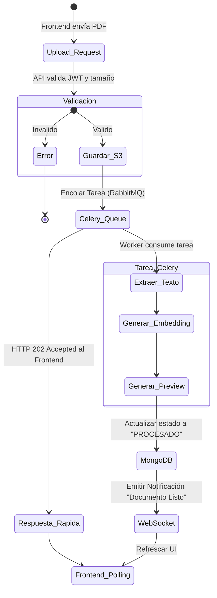

# Vista de Procesos (Comportamiento Dinámico PUDS)

La Vista de Procesos se centra en el comportamiento en tiempo de ejecución, detallando cómo se comunican los objetos, la concurrencia y la sincronización (asincronismo).

## 1. Diagrama de Secuencia: Flujo RAG (Chat con Documento)

Este diagrama modela la comunicación asíncrona entre el cliente, el backend, la base de datos vectorial (MongoDB) y el LLM.

## 2. Diagrama de Actividad: Procesamiento Asíncrono de un Documento (Celery)

Al subir un archivo pesado, la interfaz responde rápido y el procesamiento se delega a Background Workers.

