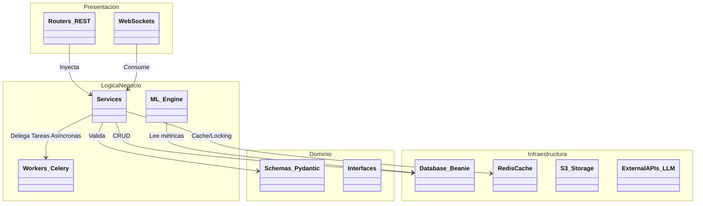
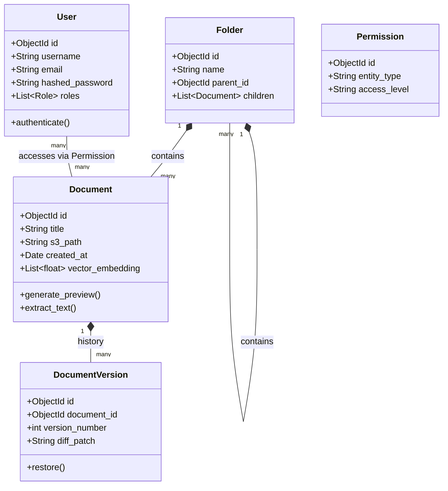
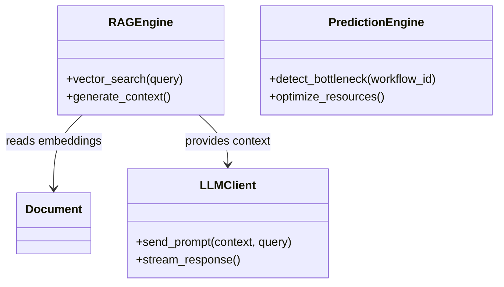
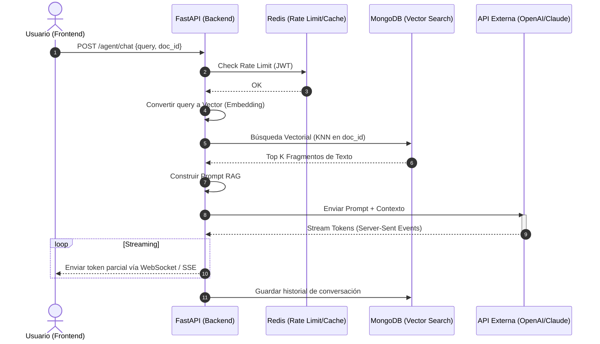
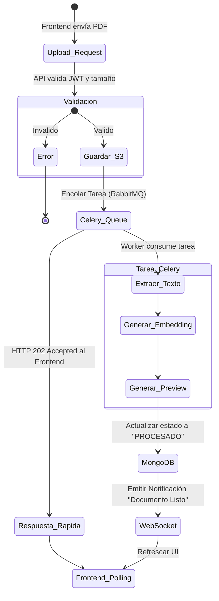

# Documento de Arquitectura de Software (SAD)
## Sistema de Gestión Documental con Inteligencia Artificial (SGDIA)

**Metodología:** Proceso Unificado de Desarrollo de Software (PUDS) / RUP
**Enfoque Arquitectónico:** Vistas "4+1" de Kruchten

Este documento actúa como el entregable central de la arquitectura del sistema SGDIA, referenciando todas las fases de la metodología PUDS.

---

## 1. Introducción
El SGDIA es una plataforma empresarial híbrida (Web/Móvil) diseñada para la gestión, almacenamiento, coedición y análisis predictivo de documentos. Integra un motor de inteligencia artificial (RAG + DL) y está construido sobre una arquitectura de microservicios orientada a eventos.

## 2. Metas y Restricciones Arquitectónicas
*   **Disponibilidad:** Arquitectura cloud-ready (despliegue en contenedores).
*   **Escalabilidad:** Separación estricta entre el procesamiento pesado (Celery/ML) y la API REST síncrona.
*   **Rendimiento:** Caché en memoria con Redis y Búsqueda Vectorial nativa.
*   **Seguridad:** RBAC granular, JWT y auditoría inmutable de 2 años.

---

## FASE 1: Vista de Casos de Uso (Modelo de Casos de Uso PUDS)

Esta vista describe la funcionalidad del sistema desde la perspectiva de sus actores. Abarca los 40 Casos de Uso (CU) definidos en los requisitos, agrupados por módulos.

### 1.1. Actores del Sistema
*   **Administrador:** Gestiona usuarios, roles, seguridad y métricas globales.
*   **Usuario Estándar:** Sube, edita, busca y colabora en documentos.
*   **Agente IA (Actor Sistema):** Procesa texto, asiste en chat y analiza datos.

### 1.2. Diagrama de Casos de Uso General (Nivel Subsistema)

```mermaid
usecaseDiagram
    actor Admin as "Administrador"
    actor User as "Usuario"
    actor AI as "Motor IA"

    package "Módulos SGDIA" {
        usecase UC_Auth as "1. Gestión y Auth (CU01-04)"
        usecase UC_Repo as "2. Repositorio (CU11-16)"
        usecase UC_Collab as "3. Edición Colaborativa (CU17-20)"
        usecase UC_UML as "4. Diagramador y Flujos (CU05-10)"
        usecase UC_IA as "5. Chat y Asistencia IA (CU21-26)"
        usecase UC_ML as "6. Predicción ML (CU27-31)"
        usecase UC_Rep as "7. Reportes Dinámicos (CU32-36)"
        usecase UC_Notif as "8. Auditoría y Notif (CU37-40)"
    }

    User --> UC_Auth
    User --> UC_Repo
    User --> UC_Collab
    User --> UC_UML
    User --> UC_IA
    User --> UC_Rep
    
    Admin --> UC_Auth
    Admin --> UC_Notif
    Admin --> UC_ML
    
    AI --> UC_IA
    AI --> UC_ML
    AI --> UC_Collab : "Sugiere contenido"
```

### 1.3. Detalle de Paquetes de Casos de Uso

#### Paquete: Repositorio e IA
```mermaid
usecaseDiagram
    actor Usuario
    usecase U11 as "Subir Documento (CU-11)"
    usecase U12 as "Búsqueda Semántica (CU-12)"
    usecase U13 as "Control de Versiones (CU-13)"
    usecase U21 as "Chat con Documento (CU-21)"
    usecase U22 as "Extraer Texto OCR (CU-22)"

    Usuario --> U11
    Usuario --> U12
    Usuario --> U13
    Usuario --> U21
    
    U11 ..> U22 : <<include>>
    U21 ..> U12 : <<include>>
```

#### Paquete: Colaboración y Diagramación
```mermaid
usecaseDiagram
    actor Usuario
    actor Colaborador
    
    usecase U17 as "Editar Simultáneamente (CU-17)"
    usecase U18 as "Ver Cursores y Avatares (CU-18)"
    usecase U05 as "Diseñar Diagrama UML (CU-05)"
    usecase U06 as "Exportar UML (CU-06)"
    
    Usuario --> U17
    Colaborador --> U17
    U17 ..> U18 : <<include>>
    
    Usuario --> U05
    U05 <.. U06 : <<extend>>
```

---

## FASE 2: Vista Lógica (Modelo Estático PUDS)

La Vista Lógica describe el modelo de objetos y la organización estructurada en paquetes del sistema SGDIA, apoyando la funcionalidad descrita en los Casos de Uso.

### 2.1. Diagrama de Paquetes (Arquitectura Capas N)

El backend de FastAPI sigue los principios de Clean Architecture y DDD (Domain-Driven Design).



### 2.2. Diagrama de Clases Central (Dominio Documental)



### 2.3. Diagrama de Clases (Machine Learning & IA)



---

## FASE 3: Vista de Procesos (Comportamiento Dinámico PUDS)

La Vista de Procesos se centra en el comportamiento en tiempo de ejecución, detallando cómo se comunican los objetos, la concurrencia y la sincronización (asincronismo).

### 3.1. Diagrama de Secuencia: Flujo RAG (Chat con Documento)

Este diagrama modela la comunicación asíncrona entre el cliente, el backend, la base de datos vectorial (MongoDB) y el LLM.



### 3.2. Diagrama de Actividad: Procesamiento Asíncrono de un Documento (Celery)

Al subir un archivo pesado, la interfaz responde rápido y el procesamiento se delega a Background Workers.



---

## FASE 4: Vista de Implementación (Componentes PUDS)

La Vista de Implementación describe cómo los elementos lógicos se empaquetan en componentes de software (módulos, librerías, contenedores).

### 4.1. Diagrama de Componentes de Software

Muestra las dependencias entre los componentes físicos del código fuente.

```mermaid
componentDiagram
    package "Aplicaciones Cliente" {
        [Angular Web App] as Web
        [Flutter Mobile App] as Mobile
    }

    package "API Gateway / Proxy" {
        [Nginx / Traefik] as Proxy
    }

    package "Backend Microservices" {
        [FastAPI Core] as CoreAPI
        [Celery Workers] as Workers
    }

    package "Servicios Externos Integrados" {
        [ONLYOFFICE Document Server] as OnlyOffice
        [OpenAI / Anthropic API] as LLM
    }

    package "Infraestructura de Datos" {
        database "MongoDB Atlas" as DB
        database "Redis Cache" as Cache
        database "MinIO / S3 Storage" as S3
    }

    Web ..> Proxy : HTTP/WSS
    Mobile ..> Proxy : HTTP/WSS
    
    Proxy ..> CoreAPI : Rutas /api/v1
    Proxy ..> OnlyOffice : Rutas /collaborate
    
    CoreAPI ..> Workers : Tareas en Broker
    Workers ..> CoreAPI : Webhook Callback
    
    CoreAPI ..> DB : Motor/Beanie
    CoreAPI ..> Cache : Aioredlock
    CoreAPI ..> S3 : Boto3
    
    Workers ..> DB : Escritura pesada
    Workers ..> LLM : Async HTTP Client
    
    Web ..> OnlyOffice : iFrame integration
```

### 4.2. Gestión de Dependencias (Gestores de Paquetes)
*   **Backend:** Gestionado mediante `requirements.txt`, empaquetando dependencias como `fastapi`, `beanie`, `motor`, `celery`, y `openai`.
*   **Frontend:** Gestionado mediante `package.json`, empaquetando `@angular/core`, `chart.js`, `socket.io-client`, entre otros.
*   **Móvil:** Gestionado mediante `pubspec.yaml`, empaquetando `flutter_riverpod`, `dio`, `go_router`, y `local_auth`.

---

## FASE 5: Vista de Despliegue (Física PUDS)

La Vista de Despliegue muestra la topología del hardware y el software en el que se ejecuta el sistema. Mapea los componentes de software (Vista de Implementación) a nodos de hardware físico o virtual (Contenedores/Nube).

### 5.1. Diagrama de Despliegue en AWS (Producción)

El sistema SGDIA está diseñado para desplegarse en Amazon Web Services utilizando contenedores ECS/Fargate para alta disponibilidad.


### 5.2. Descripción de los Nodos

*   **Nodo Cliente:** Dispositivos (Laptops, Smartphones) ejecutando el motor V8 de Chrome o el binario compilado de Flutter.
*   **ALB (Load Balancer):** Balanceador de carga L7 que distribuye el tráfico HTTPS y gestiona la terminación SSL. Mantiene persistencia de sesión para los WebSockets.
*   **Contenedores ECS (FastAPI):** Nodos sin estado (stateless) auto-escalables que procesan peticiones REST y mantienen conexiones WS.
*   **Contenedores ECS (Workers Celery):** Nodos dedicados al cómputo asíncrono.
*   **ElastiCache (Redis):** Actúa como Broker de mensajes (pub/sub) para Celery y como caché de alta velocidad.
*   **MongoDB Atlas:** Cluster distribuido en la nube, gestionado (DBaaS).
*   **Amazon S3:** Almacenamiento de objetos que provee durabilidad 99.999999999%.

---
*Fin del Documento.*
