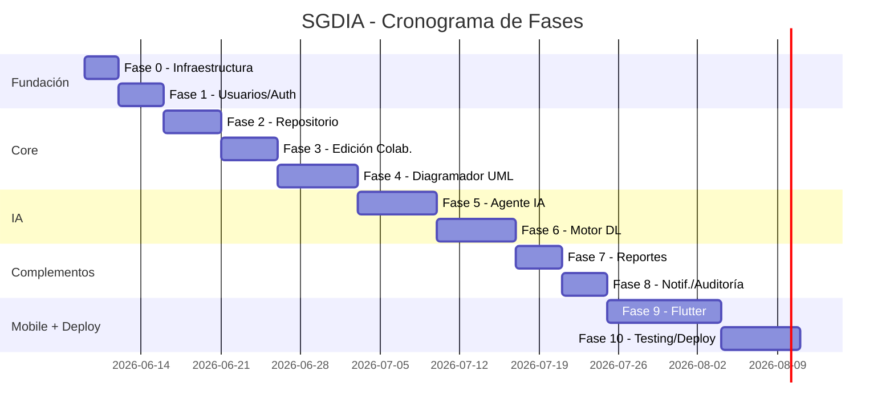

# SGDIA — Plan de Implementación por Fases

Sistema de Gestión Documental con Inteligencia Artificial — 40 Casos de Uso, 8 Módulos.

## Resumen del Proyecto

| Aspecto | Detalle |
|---|---|
| **Backend** | Python + FastAPI (REST/WebSocket) |
| **Frontend Web** | Angular 17+ (Standalone components, Signals) |
| **Móvil** | Flutter (Dart) |
| **Base de Datos** | MongoDB Atlas |
| **Archivos** | Amazon S3 |
| **Cache/PubSub** | Redis |
| **Tareas Async** | Celery + Redis |
| **Motor DL** | TensorFlow + PyTorch |
| **LLM** | Claude API / OpenAI API |
| **Editor Colab.** | ONLYOFFICE / LibreOffice Online |
| **Diagramador** | Draw.io embed / JointJS |
| **Infra** | AWS (EC2, ECS, Lambda, S3, CloudFront) |
| **CI/CD** | GitHub Actions + Docker |

## Actualizacion de ejecucion - 2026-07-17

La Fase 4 ya cuenta con implementacion de codigo para el editor UML navegable/editable, el
constructor de formularios estable, la persistencia REST versionada de politicas, la biblioteca
`/policies` y el canal WebSocket autenticado de colaboracion. Esta actualizacion sustituye las
simulaciones de colaboracion que aparecian en registros anteriores.

La prueba de despliegue aun es pendiente: se debe ejecutar backend, MongoDB y Redis en conjunto y
abrir una misma politica desde dos sesiones reales autenticadas. Solo despues de esa prueba se
podra dar por validada la colaboracion multiusuario integrada; no debe marcarse como terminada
antes.

## Actualizacion de ejecucion - 2026-07-18

La Fase 4 se reforzo para que el modelado de actividades sea usable en pantallas reales: el editor
cuenta con carriles departamentales persistentes y editables, elementos centrales de UML Activity
Diagram, conexiones de control y de objeto, y un lienzo con desplazamiento independiente. Los
paneles se reorganizan en una sola columna de trabajo cuando el ancho no alcanza, sin ocultar
herramientas.

La colaboracion ya no muestra participantes simulados. El indicador de la cabecera se alimenta del
canal WebSocket autenticado y representa solamente otras sesiones conectadas al mismo diagrama; en
ausencia de ellas muestra cero. Aun queda pendiente la prueba integrada con backend, MongoDB, Redis
y dos sesiones reales, que es necesaria para cerrar formalmente la validacion multiusuario.

## Actualizacion de ejecucion - 2026-07-19

El editor visual de la Fase 4 se migro a `@maxgraph/core` para eliminar la implementacion manual de
aristas. El motor ofrece una representacion de grafo tipada y ha sido integrado con el estado de
politicas existente: las operaciones de crear, editar, mover y conectar nodos se conservan en el
contrato de la politica y se retransmiten mediante el WebSocket autenticado.

La verificacion manual confirma que los elementos UML principales se insertan con su forma correcta,
que las flechas ortogonales se crean desde puertos explicitos y que el autocompletado con Tab genera
un flujo conectado. Sigue pendiente la misma prueba multiusuario con dos sesiones autenticas y el
backend desplegado.

---

## User Review Required

## Estado de ejecucion - 2026-07-19 (Fase 4.5 cerrada)

La Fase 4.5 de integracion real y base movil queda cerrada para desarrollo local. MongoDB contiene
10 politicas de negocio publicadas, sus diagramas por carriles, formularios, tres artefactos por
politica y 1,409 solicitudes sinteticas entre marzo y julio de 2026. Los departamentos, las cuentas
de personal y los repositorios por departamento/responsable se proyectan desde las politicas.

El ciclo validado es: politica publicada -> servicio publico -> formulario y adjuntos -> extraccion
local -> primera tarea del diagrama -> avance por responsables -> bitacoras de repositorio ->
respuesta final -> seguimiento con codigo y PIN. Se comprobo con una solicitud no sintetica que
recorrio cinco tareas y termino con respuesta publica y cinco entradas de trazabilidad.

La colaboracion UML usa JWT, permisos, WebSocket y Redis. La prueba integrada con dos cuentas
autenticadas confirmo presencia de dos usuarios y recepcion inmediata de una operacion UML. El
contador muestra solo sesiones reales adicionales y cero cuando no las hay.

La IA local activa incluye OCR/parsers para PDF, DOCX, XLSX, imagenes y texto; recuperacion
semantica local para el asistente; recomendador UML por patrones persistidos para Tab; y linea base
offline de ruta, riesgos, anomalias y carga. El entrenamiento usa 996 muestras de marzo-junio y
413 de julio, todas identificadas como sinteticas. La gobernanza mantiene la automatizacion bloqueada
hasta contar con al menos 200 flujos reales anonimizados y aprobados. Vosk se preparo para comandos
de voz locales mediante `backend/local_models/vosk-es`; nunca se usa una transcripcion simulada ni
un proveedor cloud como respaldo.

La Fase 5 esta en curso. Su primer hito esta cerrado: el WebSocket UML ahora valida, persiste y
audita cada operacion antes de sincronizarla; una prueba Docker con dos cuentas distintas confirmo
presencia 2, cambios instantaneos y recarga persistida sin guardado manual. El cliente conserva
operaciones breves durante reconexion y muestra un acuse de sincronizacion.

Quedan tres fases de cierre contando la fase activa:
1. Fase 5: correcciones P1/P2 y aceptacion guiada por usuarios reales.
2. Fase 6: entrenamiento y validacion con datos reales anonimizados, incluido el modelo profundo
   local si la gobernanza lo aprueba.
3. Fase 7: endurecimiento de produccion, Firebase/FCM con credenciales institucionales, pruebas E2E
   y despliegue observable.

> [!IMPORTANT]
> **Decisiones críticas antes de iniciar:**
> 1. ¿Se usará MongoDB Atlas (cloud) o MongoDB local para desarrollo?
> 2. ¿Se usará AWS real desde el inicio o un entorno local con Docker Compose para desarrollo?
> 3. Para el LLM: ¿Claude API, OpenAI API, o ambos con fallback?
> 4. ¿ONLYOFFICE (requiere licencia) o LibreOffice Online (open source)?
> 5. ¿JointJS (comercial) o Draw.io embed (gratuito) para el diagramador UML?

> [!WARNING]
> Este es un proyecto muy grande (40 CU, 8 módulos). La planificación está diseñada para que cada fase sea un entregable funcional independiente. Se recomienda desarrollo incremental fase por fase.

---

## Estructura del Proyecto (Monorepo)

```
sgdia/
├── backend/                 # FastAPI
│   ├── app/
│   │   ├── main.py
│   │   ├── core/            # Config, security, deps
│   │   ├── models/          # MongoDB schemas (Beanie/Motor)
│   │   ├── routers/         # API endpoints por módulo
│   │   ├── services/        # Lógica de negocio
│   │   ├── ml/              # Motor DL (modelos, inference)
│   │   └── workers/         # Celery tasks
│   ├── tests/
│   ├── requirements.txt
│   └── Dockerfile
├── frontend/                # Angular 17+
│   ├── src/app/
│   │   ├── core/            # Guards, interceptors, services
│   │   ├── shared/          # Components reutilizables
│   │   └── modules/         # Feature modules (1 por módulo)
│   └── Dockerfile
├── mobile/                  # Flutter
├── docker-compose.yml
├── .github/workflows/
└── docs/
```

---

## FASE 0 — Infraestructura Base y DevOps
**Duración estimada: 2-3 días** | **Prioridad: Crítica**

### Tareas
1. Inicializar monorepo con la estructura de carpetas
2. Configurar `docker-compose.yml` (MongoDB, Redis, backend, frontend)
3. Crear proyecto FastAPI con estructura modular
4. Crear proyecto Angular 17+ con standalone components
5. Configurar conexión MongoDB (Motor/Beanie ODM)
6. Configurar Redis para cache y pub/sub
7. Configurar Celery worker base
8. Setup CI/CD básico con GitHub Actions (lint + test)
9. Configurar CORS, variables de entorno, logging

### Archivos Clave
- `docker-compose.yml` — Orquestación local
- `backend/app/main.py` — Entry point FastAPI
- `backend/app/core/config.py` — Settings con Pydantic
- `backend/app/core/database.py` — Conexión MongoDB
- `frontend/angular.json` — Config Angular

---

## FASE 1 — Gestión de Usuarios y Roles (M-01)
**CU-01 a CU-04** | **Duración: 3-4 días** | **Prioridad: Alta**

### Backend

#### [NEW] `backend/app/models/user.py`
- Schema MongoDB para usuarios (nombre, correo, hash bcrypt, rol, estado, timestamps)

#### [NEW] `backend/app/models/role.py`
- Schema para roles con permisos granulares por módulo (lectura, escritura, aprobación)

#### [NEW] `backend/app/routers/auth.py`
- `POST /auth/register` — CU-01: Registro de usuario (solo admin)
- `POST /auth/login` — CU-02: Login con JWT (access + refresh token)
- `POST /auth/logout` — CU-04: Logout + blacklist JWT en Redis
- `POST /auth/refresh` — Renovar access token

#### [NEW] `backend/app/routers/users.py`
- CRUD de usuarios (admin only)

#### [NEW] `backend/app/routers/roles.py`
- `GET/POST/PUT/DELETE /roles` — CU-03: CRUD roles y permisos
- Invalidación de cache al modificar permisos

#### [NEW] `backend/app/core/security.py`
- Hash bcrypt, generación JWT, middleware de autenticación
- Decoradores de permisos RBAC
- Blacklist de tokens en Redis

#### [NEW] `backend/app/services/audit.py`
- Servicio transversal de auditoría (log de cada acción crítica)

### Frontend

#### [NEW] `frontend/src/app/modules/auth/`
- `login.component.ts` — Pantalla de login
- `auth.service.ts` — Servicio de autenticación JWT
- `auth.guard.ts` — Guard de rutas protegidas
- `auth.interceptor.ts` — Interceptor para adjuntar JWT

#### [NEW] `frontend/src/app/modules/admin/users/`
- `user-list.component.ts` — Lista de usuarios con filtros
- `user-form.component.ts` — Formulario crear/editar usuario
- `role-manager.component.ts` — CU-03: Gestión de roles/permisos

### NFR
- Contraseña con bcrypt, JWT 8h expiración, máx 5 intentos login, bloqueo temporal

---

## FASE 2 — Repositorio Documental (M-03)
**CU-11 a CU-16** | **Duración: 4-5 días** | **Prioridad: Alta**

### Backend

#### [NEW] `backend/app/models/document.py`
- Schema: título, descripción, tipo, tags, carpeta, versiones[], permisos, estado, timestamps

#### [NEW] `backend/app/services/storage.py`
- Integración con S3: upload multipart, URLs prefirmadas, versionado

#### [NEW] `backend/app/routers/documents.py`
- `POST /documents/upload` — CU-11: Carga con metadatos + S3
- `GET /documents/search` — CU-12: Búsqueda texto + filtros + semántica
- `GET /documents/{id}/versions` — CU-13: Historial de versiones
- `PUT /documents/{id}/permissions` — CU-14: Permisos por doc/carpeta
- `GET /documents/{id}/preview` — CU-15: Preview en navegador
- `DELETE /documents/{id}` — CU-16: Borrado lógico/físico

#### [NEW] `backend/app/services/text_extraction.py`
- Extracción de texto para indexación (PDF, Word, Excel, OCR imágenes)

### Frontend

#### [NEW] `frontend/src/app/modules/repository/`
- `document-explorer.component.ts` — Explorador tipo árbol de carpetas
- `document-upload.component.ts` — Drag & drop con metadatos
- `document-search.component.ts` — Búsqueda con filtros avanzados
- `document-preview.component.ts` — Visor inline (PDF, img, Office)
- `document-versions.component.ts` — Timeline de versiones
- `document-permissions.component.ts` — Matriz de permisos

---

## FASE 3 — Edición Colaborativa Word/Excel (M-04)
**CU-17 a CU-20** | **Duración: 4-5 días** | **Prioridad: Alta**

### Backend

#### [NEW] `backend/app/routers/collaboration.py`
- `POST /collaboration/sessions` — CU-17: Crear sesión colaborativa
- `WS /collaboration/ws/{session_id}` — CU-18: WebSocket para sync
- `POST /collaboration/{doc_id}/comments` — CU-19: Comentarios
- `POST /collaboration/sessions/{id}/close` — CU-20: Cerrar sesión

#### [NEW] `backend/app/services/collaboration.py`
- Integración ONLYOFFICE/LibreOffice Document Server API
- Gestión de sesiones activas, resolución de conflictos
- Auto-guardado y consolidación de versión al cerrar

### Frontend

#### [NEW] `frontend/src/app/modules/editor/`
- `collaborative-editor.component.ts` — Iframe ONLYOFFICE + overlay
- `editor-toolbar.component.ts` — Controles de sesión
- `comments-panel.component.ts` — Panel lateral de comentarios
- `active-users.component.ts` — Indicador de usuarios conectados

### Dependencias
- ONLYOFFICE Document Server (Docker container)

---

## FASE 4 — Diagramador UML de Políticas (M-02)
**CU-05 a CU-10** | **Duración: 5-7 días** | **Prioridad: Alta**

### Backend

#### [NEW] `backend/app/models/policy.py`
- Schema: nombre, diagrama_json, versiones[], estado (borrador/revisión/publicada), aprobador

#### [NEW] `backend/app/routers/policies.py`
- `POST /policies` — CU-05: Crear diagrama UML
- `WS /policies/ws/{policy_id}` — CU-06: Colaboración tiempo real
- `POST /policies/{id}/publish` — CU-07: Flujo revisión→aprobación→publicación
- `GET /policies/{id}/versions` — CU-09: Versionado
- `GET /policies/{id}/export` — CU-10: Exportar SVG/PNG/XMI

#### [NEW] `backend/app/services/workflow_engine.py`
- CU-08: Motor que interpreta diagramas UML publicados
- Parser JSON→nodos de actividad, condiciones, swimlanes
- Enrutamiento de tareas a responsables según condiciones

#### [NEW] `backend/app/models/workflow.py`
- Schema: instancia de workflow, estado actual, historial de nodos recorridos

### Frontend

#### [NEW] `frontend/src/app/modules/uml-designer/`
- `uml-canvas.component.ts` — Canvas con JointJS/Draw.io para actividades UML 2.5
- `element-palette.component.ts` — Paleta: inicio, fin, actividad, decisión, fork, join, swimlane
- `property-panel.component.ts` — Editor de propiedades del elemento
- `collaboration-overlay.component.ts` — Cursores remotos + avatares
- `version-history.component.ts` — Comparador visual de versiones
- `export-dialog.component.ts` — Opciones de exportación

### NFR
- Latencia WebSocket < 100ms, hasta 20 colaboradores, OT/CRDT para conflictos
- Autoguardado cada 30s, reconexión con backoff exponencial

---

## FASE 5 — Agente IA de Políticas (M-05)
**CU-21 a CU-26** | **Duración: 5-7 días** | **Prioridad: Alta**

### Backend

#### [NEW] `backend/app/services/rag_engine.py`
- Pipeline RAG: embedding de políticas → MongoDB Atlas Vector Search
- Búsqueda semántica por similitud coseno
- Prompt engineering con contexto recuperado

#### [NEW] `backend/app/services/llm_client.py`
- Cliente configurable Claude/OpenAI con fallback automático
- Rate limiting, retry, token counting

#### [NEW] `backend/app/services/asr_service.py`
- CU-22: Transcripción audio→texto (Whisper/modelo propio)

#### [NEW] `backend/app/services/ocr_service.py`
- CU-23: Extracción texto de documentos adjuntos

#### [NEW] `backend/app/routers/agent.py`
- `POST /agent/chat` — CU-21: Consulta por texto
- `POST /agent/audio` — CU-22: Consulta por audio
- `POST /agent/document` — CU-23: Consulta con doc adjunto
- `GET /agent/conversations` — CU-24: Historial
- `POST /agent/feedback` — CU-25: Retroalimentación
- `POST /agent/escalate` — CU-26: Escalar a humano

#### [NEW] `backend/app/models/conversation.py`
- Schema: mensajes[], usuario, scores de confianza, feedback

#### [NEW] `backend/app/services/agent_training.py`
- CU-25: Pipeline de re-entrenamiento con datos de feedback

### Frontend

#### [NEW] `frontend/src/app/modules/agent/`
- `chat-interface.component.ts` — Chat con markdown rendering
- `audio-recorder.component.ts` — Grabación/envío de audio
- `file-attach.component.ts` — Adjuntar documentos al chat
- `conversation-history.component.ts` — Historial de conversaciones
- `feedback-widget.component.ts` — Rating + comentario por respuesta
- `escalation-panel.component.ts` — Panel de escalamiento a humano

---

## FASE 6 — Motor de Deep Learning / Predicción (M-06)
**CU-27 a CU-31** | **Duración: 5-7 días** | **Prioridad: Alta**

### Backend

#### [NEW] `backend/app/ml/route_predictor.py`
- CU-27: Modelo predictivo de ruta óptima para documentos (basado en historial)

#### [NEW] `backend/app/ml/bottleneck_detector.py`
- CU-28: Detector de cuellos de botella en flujos de políticas

#### [NEW] `backend/app/ml/anomaly_detector.py`
- CU-29: Detección de anomalías en flujos documentales (autoencoders)

#### [NEW] `backend/app/ml/resource_optimizer.py`
- CU-30: Modelo de priorización/asignación de recursos

#### [NEW] `backend/app/routers/predictions.py`
- `GET /predictions/routes/{doc_id}` — CU-27
- `GET /predictions/bottlenecks` — CU-28
- `GET /predictions/anomalies` — CU-29
- `POST /predictions/resources` — CU-30
- `GET /predictions/dashboard` — CU-31

#### [NEW] `backend/app/workers/ml_tasks.py`
- Tareas Celery para entrenamiento/inferencia async

### Frontend

#### [NEW] `frontend/src/app/modules/predictions/`
- `predictions-dashboard.component.ts` — CU-31: Dashboard con gráficas
- `route-prediction.component.ts` — Visualización de ruta predicha
- `bottleneck-alerts.component.ts` — Alertas de cuellos de botella
- `anomaly-timeline.component.ts` — Timeline de anomalías detectadas

---

## FASE 7 — Reportes Dinámicos (M-07)
**CU-32 a CU-36** | **Duración: 3-4 días** | **Prioridad: Media**

### Backend

#### [NEW] `backend/app/routers/reports.py`
- `POST /reports` — CU-32: Solicitar reporte por formulario
- `POST /reports/voice` — CU-33: Solicitar por voz (ASR→parámetros)
- `POST /reports/schedule` — CU-34: Programar reporte recurrente
- `GET /reports/{id}/view` — CU-35: Datos para visualización
- `CRUD /reports/templates` — CU-36: Plantillas de reporte

#### [NEW] `backend/app/services/report_generator.py`
- Generación async (Celery) en PDF, Excel, CSV, JSON
- Motor de plantillas con variables dinámicas

#### [NEW] `backend/app/workers/report_tasks.py`
- Scheduler para reportes recurrentes (Celery Beat)

### Frontend

#### [NEW] `frontend/src/app/modules/reports/`
- `report-builder.component.ts` — Formulario wizard de reporte
- `voice-report.component.ts` — Solicitud por voz
- `report-viewer.component.ts` — CU-35: Gráficas interactivas (Chart.js/D3)
- `report-scheduler.component.ts` — Programar recurrencia
- `template-manager.component.ts` — CRUD plantillas

---

## FASE 8 — Notificaciones y Auditoría (M-08)
**CU-37 a CU-40** | **Duración: 3-4 días** | **Prioridad: Media**

### Backend

#### [NEW] `backend/app/routers/notifications.py`
- `WS /notifications/ws` — CU-37: Notificaciones push en tiempo real
- `GET /notifications` — Historial de notificaciones
- Integración email (SMTP/SES)

#### [NEW] `backend/app/routers/audit.py`
- `GET /audit/logs` — CU-38: Consulta de logs con filtros
- `GET /audit/trace/{entity_id}` — CU-39: Trazabilidad de documento/trámite
- `GET /audit/export` — Exportar CSV/JSON

#### [NEW] `backend/app/routers/settings.py`
- `GET/PUT /settings` — CU-40: Configuración del sistema (hot-reload)

#### [MODIFY] `backend/app/services/audit.py`
- Colección append-only en MongoDB para logs inmutables
- Retención mínima 2 años

### Frontend

#### [NEW] `frontend/src/app/modules/notifications/`
- `notification-bell.component.ts` — Icono con badge + dropdown
- `notification-center.component.ts` — Centro de notificaciones

#### [NEW] `frontend/src/app/modules/audit/`
- `audit-log-viewer.component.ts` — Tabla con filtros avanzados
- `traceability-timeline.component.ts` — CU-39: Línea de tiempo visual
- `system-settings.component.ts` — CU-40: Panel de configuración

---

## FASE 9 — App Móvil Flutter (Cross-cutting)
**Duración: 7-10 días** | **Prioridad: Media**

### Componentes principales
- Auth module (login, JWT)
- Repositorio documental (buscar, ver, descargar)
- Chat con agente IA (texto + audio)
- Notificaciones push (Firebase)
- Dashboard de predicciones (resumen)

---

## FASE 10 — Pruebas, Optimización y Deploy
**Duración: 5-7 días**

- Tests unitarios con pytest (cobertura > 80%)
- Tests E2E con Playwright (flujos críticos)
- Optimización de queries MongoDB (índices compuestos)
- Configuración AWS producción (ECS, CloudFront, S3)
- Blue-green deployment pipeline
- Observabilidad: CloudWatch + Sentry + Prometheus

---

## Orden de Ejecución Recomendado



## Verificación

### Por cada fase:
1. **Tests unitarios** (pytest) para cada endpoint/servicio
2. **Tests de integración** para flujos completos
3. **Verificación manual** en navegador (Angular dev server)
4. **Validación de OpenAPI** auto-generada

### Al final:
- Playwright E2E para los 40 CU
- Load testing para validar < 2s en 95% de operaciones
- Security audit (OWASP Top 10)
